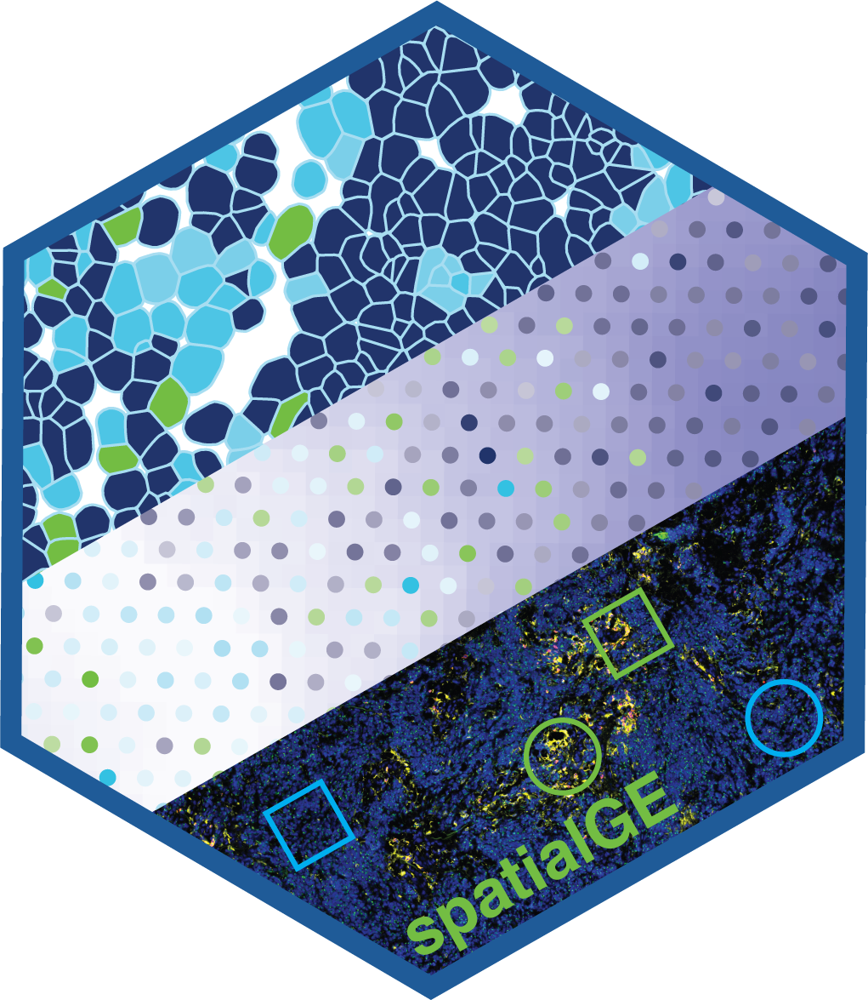
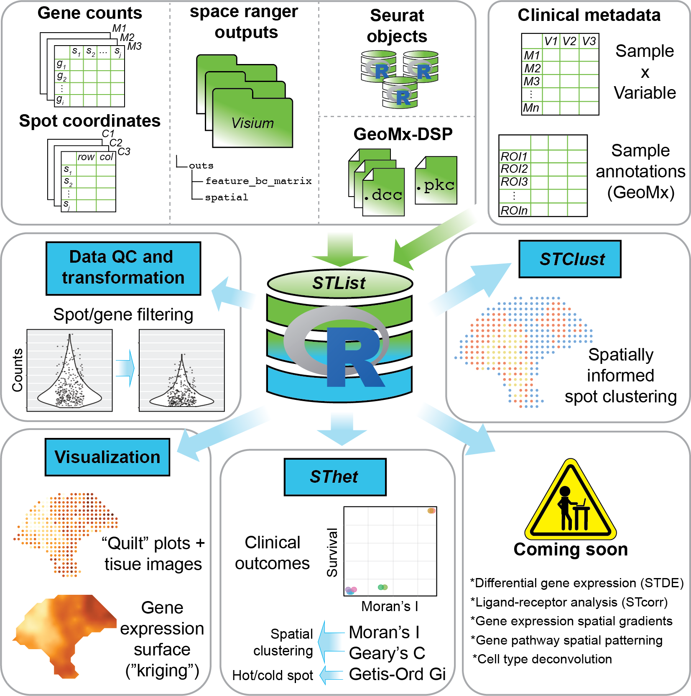

# spatialGE 

An R package for the visualization and analysis of spatially resolved transcriptomics data,
such as those generated by 10X Visium. The functions in spatialGE allow for the study of 
gene expression in tissue sections via spatial interpolation, RNA-Seq data deconvolution, 
and autocorrelation statistics, as well as correlation with clinical/phenotype data. 

<p align="center">

</p>

## Installation

The `spatialGE` repository is available at GitHub and can be installed via `devtools`.
```
devtools::install_github("fridleylab/spatialGE")
```

For a tutorial on how to use `spatialGE`, please go to:
https://fridleylab.github.io/spatialGE/

The code for `spatialGE` can be found here:
https://github.com/FridleyLab/spatialGE
