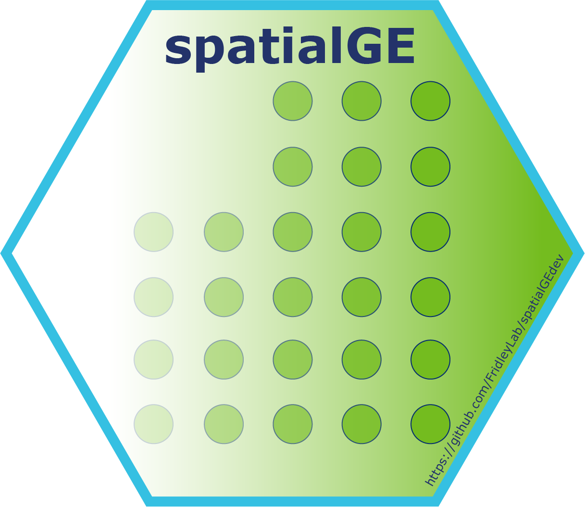

# spatialGEdev 

An R package for the visualization and analysis of spatially resolved transcriptomics data.
The functions in spatialGE allow for the study of gene expression in tissue sections via 
spatial interpolation, RNA-Seq data deconvolution, and autocorrelation statistics, as well
as correlation with clinical/phenotype data. 