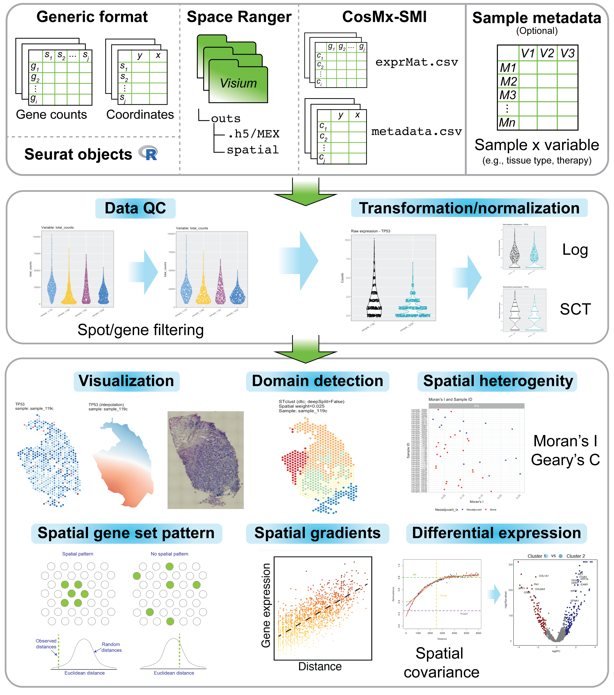
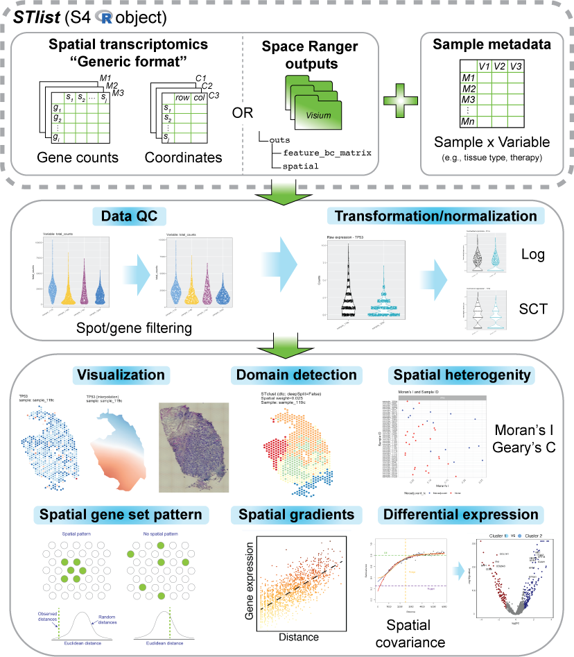

# spatialGE

An R package for the visualization and analysis of spatially-resolved transcriptomics data,
such as those generated with 10X Visium. The **spatialGE** package features a data object 
(STlist: Spatial Transctiptomics List) to store data and results from multiple tissue sections, 
as well as associated analytical methods for:
<<<<<<< HEAD

=======
>>>>>>> 3db90f5bf04af3fb4f198dfb630dd1b87ad08ae2
- Visualization: `STplot`, `gene_interpolation`, `STplot_interpolation` to explore gene 
expression in spatial context.
- Spatial autocorrelation: `SThet`, `compare_SThet` to assess the level of spatial uniformity in 
gene expression by calculating Moran's I and/or Geary's C and qualitatively explore correlations with
sample-level metadata (i.e., tissue type, therapy, disease status).
- Tissue domain/niche detection: `STclust` to perform spatially-informed hierarchical clustering for
prediction of tissue domains in samples.
- Gene set spatial enrichment: `STenrich` to detect gene sets with indications of spatial 
patterns (i.e., non-spatially uniform gene set expression).
- Gene expression spatial gradients: `STgradient` to detect genes with evidence of variation in 
expression with respect to a tissue domain.

The methods in the initial spatialGE release, technical details, and their utility are presented in
this publication: https://doi.org/10.1093/bioinformatics/btac145. For details on the recently
developed methods `STenrich` and `STgradient`, please refer to the spatialGE documentation.

<p align="center">
<<<<<<< HEAD

=======

>>>>>>> 3db90f5bf04af3fb4f198dfb630dd1b87ad08ae2
</p>

## Installation

The `spatialGE` repository is available at GitHub and can be installed via `devtools`.
```
devtools::install_github("fridleylab/spatialGE")
```

## How to use spatialGE

For tutorials on how to use `spatialGE`, please go to:
https://fridleylab.github.io/spatialGE/

The code for `spatialGE` can be found here:
https://github.com/FridleyLab/spatialGE

## spatialGE-web

An point-and-click web application that allows usage of spatialGE methods without the need of
coding/scripting is under development. Stay tuned!

## How to cite

When using spatialGE, please cite the following publication:

Ospina, O. E., Wilson C. M., Soupir, A. C., Berglund, A. Smalley, I., Tsai, K. Y., Fridley, B. L. 2022. 
spatialGE: quantification and visualization of the tumor microenvironment heterogeneity using spatial 
transcriptomics. Bioinformatics, 38:2645-2647. https://doi.org/10.1093/bioinformatics/btac145
