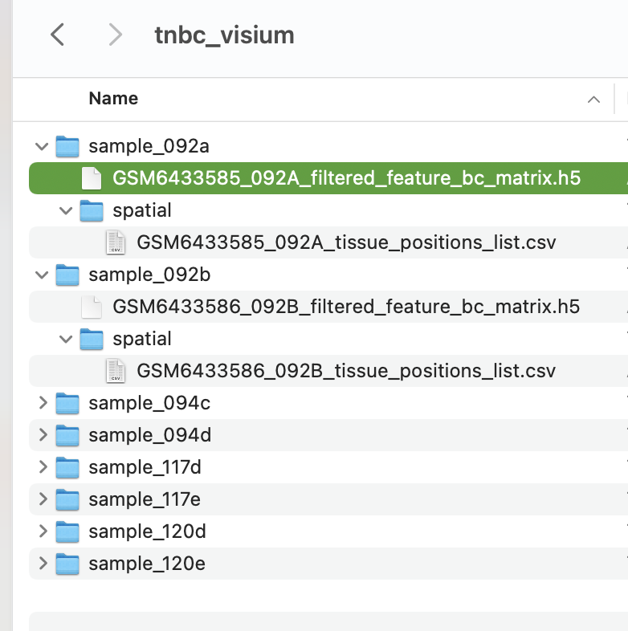
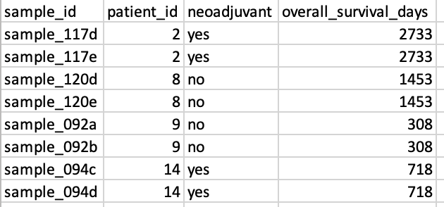

```{r vig_settings, include = FALSE}
knitr::opts_chunk$set(
  collapse=TRUE,
  comment="#>",
  fig.width=10, fig.height=7
)
```

The package `spatialGE` provides a set of tools for the visualization of gene expression from 
spatially-resolved transcriptomic experiments, such as those generated by the Visium platform. 

## Installation
The `spatialGE` repository is available at GitHub and can be installed via `devtools`.
To install `devtools`, in case is not already installed in your R console, please run the 
following code:

```{r install_devtools}
if("devtools" %in% rownames(installed.packages()) == FALSE) {
  install.packages("devtools")
}
```

After making sure `devtools` is installed, proceed to install `spatialGE`:

```{r install_spatialGE, eval=F}
#devtools::install_github("fridleylab/spatialGE")
```

To use `spatialGE`, load the package using:

```{r load_spatialGE}
library('magrittr') # Use of pipe operator in this vignette
#library('spatialGE')
devtools::load_all('../')
```

## Spatially-resolved expression of triple negative breast cancer tumor biopsies
To show the utility of some of the functions in `spatialGE`, we use the spatial 
transcriptomics data set generated with the platform Visium by [Bassiouni et al. (2023)](https:doi.org/10.1158/0008-5472.CAN-22-2682). 
This data set includes triple negative breast cancer biopsies from 22 patients, with 
two tissue slices per patient. The Visium platform allows gene expression quantitation
in approximately 5000 capture areas (i.e., "spots") separated each other by 100μM.
The spots are 50μM in diameter, which corresponds to 1-10 cells according to the 
manufacturer.

Data for all the tissue slices are available at the Gene Expression Omnibus (GEO).
For the purpose of this tutorial, we will use eight samples from four patients. The
GEO repositories can be accessed using the following links:
- [sample_117d](https://www.ncbi.nlm.nih.gov/geo/query/acc.cgi?acc=GSM6433599)
- [sample_117e](https://www.ncbi.nlm.nih.gov/geo/query/acc.cgi?acc=GSM6433600)
- [sample_120d](https://www.ncbi.nlm.nih.gov/geo/query/acc.cgi?acc=GSM6433611)
- [sample_120e](https://www.ncbi.nlm.nih.gov/geo/query/acc.cgi?acc=GSM6433612)
- [sample_092a](https://www.ncbi.nlm.nih.gov/geo/query/acc.cgi?acc=GSM6433585)
- [sample_092b](https://www.ncbi.nlm.nih.gov/geo/query/acc.cgi?acc=GSM6433586)
- [sample_094c](https://www.ncbi.nlm.nih.gov/geo/query/acc.cgi?acc=GSM6433593)
- [sample_094d](https://www.ncbi.nlm.nih.gov/geo/query/acc.cgi?acc=GSM6433594)

Within each link, locate the `filtered_feature_bc_matrix.h5` and `tissue_positions_list.csv.gz`
files and download them. Create a folder in your Desktop with the name `tnbc_visium`.
Within that folder, create eight folders, each with the sample names previously shown
(i.e., `sample_117d`, `sample_117e`, `sample_120d`, ...). Next, place within each 
folder the corresponding `filtered_feature_bc_matrix.h5` file. Finally, create within 
each folder, another folder named `spatial` and place the corresponding `tissue_positions_list.csv.gz`
file within that `spatial` folder. The file structure explained, corresponds roughly to
the outputs generated by "space ranger", the software provided by 10X Genomics to
process Visium data.



## Creating an STList (Spatial Transcriptomics List)
In spatialGE, raw and processed data are stored in an STlist (S4 class object). 
The STlist can be created with the function `STlist`, which can take different 
inputs (see [here](https://fridleylab.github.io/spatialGE/reference/STList.html) 
for more info). In this tutorial we will provide the file paths to the folders 
created in the previous step. 

Additionally, we will input some clinical meta data associated with the samples.
The meta data is provided in the form of a comma-delimited file. We have extracted
some of the meta data for the eight samples from the original publication and saved it 
as part of the `spatialGE` package. The user is encouraged to look at the structure
of this file by downloading from the [GitHub repository](https://github.com/FridleyLab/spatialGE/tree/main/inst/extdata/tnbc_bassiouni/bassiouni_clinical.csv).
The most important aspect when constructing this file for other data sets, is that
the sample names are in the first column, and that they match the names of the 
folders containing the data:



Once the folders with samples have been created, we can use R to generate the file
paths to be passed to the `STlist` function. Assuming that the user created the
folder in the computer's Desktop: 

```{r data_fpaths}
visium_folders <- list.dirs('~/Desktop/tnbc_visium/', full.names=T, recursive=F)
```

The meta data can be accessed directly from the `spatialGE` package installed in 
the computer like so:

```{r data_fpaths2}
data_files <- system.file("extdata/tnbc_bassiouni", package="spatialGE")
clin_file <- list.files(data_files, full.names=T, recursive=F, pattern='clinical')
```

We can load the files into an STlist using this command:

```{r create_stlist, warning=F}
tnbc <- STlist(rnacounts=visium_folders, samples=clin_file)
```

The `tnbc` object is an STlist that contains the count data, spot coordinates, and 
clinical meta data.

```{r call_stlist}
tnbc
```

## Exploring variation between spatial arrays
The function `pseudobulk_pca` allows for a quick snapshot of the variation in gene
expression among samples. The function creates 'bulk' RNAseq data sets by combining
all counts from each sample. Then, it log transforms the 'pseudo bulk' RNAseq counts
and runs a Principal Component Analysis (PCA). Note that the spatial (x, y) coordinate 
information is not considered in this analysis, which is intended only as an exploratory 
analysis. In this case, we apply the function to look for agreement between samples from 
the same patient: It is expected that tissue slices from the same patient are more 
similar among them than tissue slices from other patients. The `pseudobulk_pca` 
allows to map a clinical variable to the PCA (patient in this example), by including 
the name of the column from the sample metadata file.

```{r pca_chunk, fig.align='center', fig.width=5, fig.height=4.5}
pseudobulk_pca(tnbc, plot_meta='patient_id')
```

## Transformation of spatially-resolved transcriptomics data
Many transformation methods are available RNA-Seq count data. In `spatialGE`, the 
function `transform_data` applies log-transformation to the data, after library size 
normalization. Similar to Seurat, it applies a scaling factor (`scale_f=10000` by 
default).

```{r norm_chunk}
tnbc <- transform_data(tnbc)
```

## Visualization of gene expression from spatially-resolved transcriptomics data
After data transformation, expression of specific genes can be visualized using 'quilt' 
plots. The function `STplot` shows the transformed expression of one or several genes. 
We have adopted the color palettes from the packages `khroma` and `RColorBrewer`. 
The name of a color palette can be passed using the argument `color_pal`. The default 
behavior of the function produces plots for all samples within the STlist, but we 
can pass specific samples to be plotted using the argument `samples`.

Let's produce a quilt plot for the genes _MS4A1_ and _ESR1_ (B-cell marker and 
estrogen receptor, respectively), for sample number 2 of patient 1 (`samples=sample_117e`).

```{r genequilt_chunk}
quilts1 <- STplot(tnbc, 
                  genes=c('MS4A1', 'TP53'), 
                  #samples='sample_117e', 
                  color_pal='BuRd', 
                  ptsize=2)
```

Because `spatialGE` functions output lists of ggplot objects, we can plot the results 
side-by-side using functions such as `ggarrange()`.

```{r genequilt_chunk2, fig.align='center', fig.width=6, fig.height=4}
ggpubr::ggarrange(plotlist=quilts1, nrow=1, ncol=2, legend='bottom')
```

We can see that gene expression patterns of both genes are almost opposite: *MS4A1*
is expressed in the upper right portion of the tissue, whereas *MLANA* is expressed
in the left portion. The left portion of the tissue corresponds to the melanoma 
compartment detected by Thrane et al., and the upper right portion corresponds to
the a lymphoid tissue area (see Figure 3 of [their study](https:doi.org/10.1158/0008-5472.CAN-18-0747)).

### Spatial interpolation of gene expression
We can predict a smooth gene expression surface for each sample. In `spatialGE`, 
this prediction is achieved by a widely used spatial interpolation method in
spatial statistics. The method known as 'kriging' allows for the estimation of gene 
expression values in the un-sampled areas between spots, or cells/spots for which the 
sample processing failed to provide data. Estimating a transcriptomic surface via 
kriging assumes that gene expression of two given points is correlated to the 
spatial distance between them.

The function `gene_krige()` performs kriging of gene expression via the `geoR`
package. We specify that kriging will be performed for two of the spatial 
arrays (`samples=c('ST_mel1_rep2', 'ST_mel2_rep1')`):

```{r genekrige_chunk}
melanoma <- gene_interpolation(melanoma, 
                               genes=c('MS4A1', 'MLANA'), 
                               samples=c('ST_mel1_rep2', 'ST_mel2_rep1'))
```

The surfaces can be visualized using the `STplot_interpolation()` function:

```{r plotkrige_chunk1, fig.align='center', fig.width=6, fig.height=4}
kriges1 <- STplot_interpolation(melanoma,
                                genes=c('MS4A1', 'MLANA'),
                                samples='ST_mel1_rep2',
                                visium=F)
ggpubr::ggarrange(plotlist=kriges1, nrow=1, ncol=2, common.legend=T, legend='bottom')
```

By looking at the transcriptomic surfaces of the two genes, it is easier to detect
where "pockets" of high and low expression are located within the tissue. It is 
now more evident that expression of *MS4A1* is lower on the left (melanoma) region of 
the tumor slice, compared to the rest of the slice.

Just like with `STplot()`, we can control which tissue slice to plot with 
the `samples` argument. These commands plot sample 1 from patient 2 ("ST_mel2_rep1").

```{r plotgenekrige_chunk2, fig.align='center', fig.width=6, fig.height=4}
kriges2 <- STplot_interpolation(melanoma,
                                genes=c('MS4A1', 'MLANA'),
                                samples='ST_mel2_rep1',
                                visium=F)
ggpubr::ggarrange(plotlist=kriges2, nrow=1, ncol=2, common.legend=T, legend='bottom')
```

## Unsupervised spatially-informed clustering (*STclust*)
Detecting tissue compartments or niches is an important part of the study of the 
tissue architecture. We can do this by applying *STclust*, a spatially-informed 
clustering method implemented in `spatialGE`. STclust uses weighted average matrices 
to capture the transcriptomic differences among the cells/spots. First, top variable genes
are identified via Seurat's `FindVariableFeatures`, and transcriptomic scaled distances 
are calculated using only those genes. Next, scaled euclidean distances are
computed for the physical (x, y) distances among cells/spots. The user defines a 
weight (`ws`) from 0 to 1, to apply to the physical distances. The higher the weight, 
the less biologically meaningful the clustering is given that the groups will only 
reflect the physical distances between the cells/spots and less information on the 
transcriptomic profiles will be used. After many tests, we have found that weights 
between 0.025 - 0.25 are enough to capture the tissue heterogeneity. The method 
uses [dynamic tree cuts](https://doi.org/10.1093/bioinformatics/btm563) to
define the number of clusters. But users can also test a series of k values (`ks`).
For a more  detailed description of the method, please refer to the [paper describing spatialGE](https://doi.org/10.1093/bioinformatics/btac145).

We'll try several weights to see it's effect on the cluster assignments:

```{r clustespots_chunk}
melanoma <- STclust(melanoma, 
                    ks='dtc', 
                    ws=c(0, 0.025, 0.05, 0.2))
```

Results of clustering can be plotted via the `STplot()` function:

```{r plotclustspots_chunk, fig.align='center', fig.width=7, fig.height=6}
cluster_p <- STplot(melanoma, 
                    samples='ST_mel1_rep2', 
                    ws=c(0, 0.025, 0.05, 0.2),
                    visium=F, 
                    ptsize=2)
ggpubr::ggarrange(plotlist=cluster_p, nrow=2, ncol=2, legend='right')
```

We can see that at `w=0.025` and `w=0.05`, tissue compartments are observed for the lymphoid tissue 
(upper right portion of the tissue in yellow), with small pockets surrounding the melanoma
area (blue), possibly indicating immune activity around the tumor spots. The color
red likely corresponds to stromal spots. We have used here the dynamic tree cuts (`dtc`) to 
automatically select the number of clusters, but users can define their own range of k to be 
evaluated, allowing further isolation of cell types.

## Association between spatial heterogeneity and clinical variables (*SThet*)
To explore the relationship between a clinical variable of interest and the 
level of gene expression spatial uniformity within a sample, we can use the 
`SThet()` function:

```{r sthet_chunk}
melanoma <- SThet(melanoma, 
                  genes=c('MAPKAPK2', 'TYR', 'CD19'), 
                  method='moran')
```

The `SThet` function calculates the Moran's I statsitic (or Geary's C) to measure
the level of spatial heterogeneity in the expression of the genes ('PDCD1', 'MS4A1', 'CD3E').
The estimates can be compared across samples using the function `compare_SThet()`

```{r clinplot_chunk, fig.align='center', fig.height=3.6, fig.width=6}
p = compare_SThet(melanoma, 
                  samplemeta='survival_months', 
                  color_by='patient',
                  gene=c('MAPKAPK2', 'TYR', 'CD19'))

print(p)
```

The calculation of spatial statistics and multi-sample comparison with `SThet` and
`compare_SThet` provides and easy way to identify samples and genes exhibiting spatial
patterns. The previous figure shows that the two samples from patient 1 are different in
the spatial expression patterns of *CD19*, *MAPKAPK2*, and *TYR* (we have already 
explored this data set to pick these genes). In the case of the gene *CD19* and *TYR*,
the differences likely correspond to the marked immune/B-cell and tumor compartments 
respectively, which can be observed in the gene expression surfaces of samples 1 and 2
from patient 1. Statistics like Moran's I or Geary's C quantify the level to which 
the expression of a gene is "concentrated" in an region of the sample (or conversely 
if it is evenly distributed). It can also be seen in this plot that patient 1 also
had the highest overal survival within the data set. It is difficult to make assertions
on the effect of spatial heterogeinity on overal survival with this small sample
size, but we present this plot as an example of the type of exploratory analysis that
spatialGE can conduct.

See the table below for a simplistic interpretation of the spatial autocorrelation 
statistics calculated in `spatialGE`:

```{r sphet_table, echo=F}
sphet_info <- tibble::tibble("Low"=c('Dispersion', 'Clustering'),
"Statistic"=c('Moran’s I', 'Geary’s C'),
"High"=c('Clustering', 'Dispersion')
)

kableExtra::kbl(sphet_info, align='c', centering=T) %>%
  kableExtra::kable_styling(position="center", full_width=F)
```

The computed statistics are stored in the STlist for additional analysis/plotting 
that the user may want to complete. The statistics value can be accessed as a data
frame using a command like:

```{r stats_slot}
melanoma@gene_meta[['ST_mel1_rep1']] %>%
  dplyr::filter(gene %in% c('MAPKAPK2', 'TYR', 'CD19'))
```

<details>
  <summary>**Session Info**</summary>
```{r}
sessionInfo()
```
</details>

