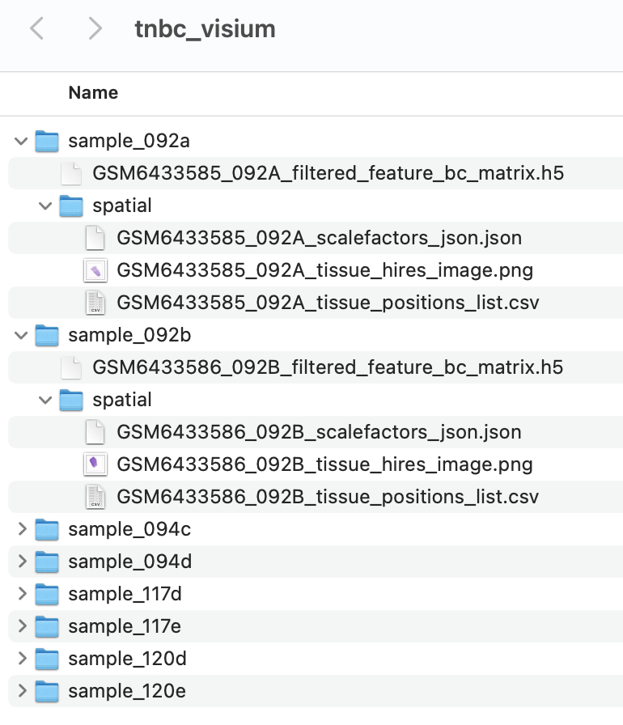

```{r vig_settings, include=F}
knitr::opts_chunk$set(
  collapse=TRUE,
  comment="#>",
  fig.width=8, fig.height=5
)
```

The package ***`spatialGE`*** provides a collection of tools for the visualization of gene expression from spatially-resolved transcriptomic experiments. The data input methods have been designed so that any data can be analyzed as long as it contains gene expression counts per region of interest (ROI), spot, or cell, and the spatial coordinates of those ROIs, spots, or cells, as it is generated in platforms such as GeoMx, Visium, and CosMx-SMI. Specialized data input options are available to allow interoperability with workflows such as [*Space Ranger*](https://support.10xgenomics.com/spatial-gene-expression/software/pipelines/latest/what-is-space-ranger).

## Installation

The `spatialGE` repository is available at GitHub and can be installed via `devtools`. To install `devtools` (in case it is not already installed in your R), please run the following code:

```{r install_devtools}
if("devtools" %in% rownames(installed.packages()) == FALSE){
  install.packages("devtools")
}
```

After making sure `devtools` is installed, proceed to install `spatialGE`:

```{r install_spatialGE, eval=T}
#devtools::install_github("fridleylab/spatialGE")
```

To use `spatialGE`, load the package.

```{r load_spatialGE, message=F}
library('spatialGE')
```

## Spatially-resolved expression of triple negative breast cancer tumor biopsies

To show the utility of some of the functions in `spatialGE`, we use the spatial transcriptomics data set generated with the platform Visium by @bassiouni_2023. This data set includes triple negative breast cancer biopsies from 22 patients, with two tissue slices per patient. The Visium platform allows gene expression quantitation in approximately 5000 capture areas (i.e., "spots") separated each other by 100μM. The spots are 55μM in diameter, which corresponds to 1-10 cells [according to the manufacturer](https://kb.10xgenomics.com/hc/en-us/articles/360035487952-How-many-cells-are-captured-in-a-single-spot-).

Data for all the tissue slices are available at the Gene Expression Omnibus (GEO). For the purpose of this tutorial, we will use eight samples from four patients. The GEO repositories can be accessed using the following links:

-   [sample_117d](https://www.ncbi.nlm.nih.gov/geo/query/acc.cgi?acc=GSM6433599)
-   [sample_117e](https://www.ncbi.nlm.nih.gov/geo/query/acc.cgi?acc=GSM6433600)
-   [sample_120d](https://www.ncbi.nlm.nih.gov/geo/query/acc.cgi?acc=GSM6433611)
-   [sample_120e](https://www.ncbi.nlm.nih.gov/geo/query/acc.cgi?acc=GSM6433612)
-   [sample_092a](https://www.ncbi.nlm.nih.gov/geo/query/acc.cgi?acc=GSM6433585)
-   [sample_092b](https://www.ncbi.nlm.nih.gov/geo/query/acc.cgi?acc=GSM6433586)
-   [sample_094c](https://www.ncbi.nlm.nih.gov/geo/query/acc.cgi?acc=GSM6433593)
-   [sample_094d](https://www.ncbi.nlm.nih.gov/geo/query/acc.cgi?acc=GSM6433594)

Within each link, locate the `filtered_feature_bc_matrix.h5` and `tissue_positions_list.csv.gz` files and download them. Create a folder in your Desktop with the name `tnbc_visium`. Within that folder, create eight folders, each with the sample names previously shown (i.e., `sample_117d`, `sample_117e`, `sample_120d`, ...). Next, place within each folder the corresponding `filtered_feature_bc_matrix.h5` file. Finally, create within each folder, another folder named `spatial` and place the corresponding `tissue_positions_list.csv.gz` file within that `spatial` folder. This file structure, corresponds roughly to the file structure in outputs generated by Space Ranger, the software provided by 10X Genomics to process Visium data.


<p align="center">

</p>

## Creating an STList (Spatial Transcriptomics List)

In `spatialGE`, raw and processed data are stored in an ***STlist*** (S4 class object). The STlist can be created with the function `STlist`, which can take data using different formats (see [here](https://fridleylab.github.io/spatialGE/reference/STlist.html) for more info or type `?STlist` in the R console). In this tutorial we will provide the file paths to the folders created in the previous step.

Additionally, we will input meta data associated with each sample. The meta data is provided in the form of a comma-delimited file. We have extracted some of the clinical meta data for the eight samples from the original publication and saved it as part of the `spatialGE` package. The user is encouraged to look at the structure of this file by downloading it from the [GitHub repository](https://github.com/FridleyLab/spatialGE/tree/main/inst/extdata/tnbc_bassiouni/bassiouni_clinical.csv). The most important aspect when constructing this file is that the sample names are in the first column, and they match the names of the folders containing the data:


<p align="center">

</p>


Once the folders with samples have been created, we can use R to generate the file paths to be passed to the `STlist` function. Assuming that the user created the folder in the computer's Desktop:

```{r data_fpaths}
visium_folders <- list.dirs('~/Desktop/tnbc_visium/', full.names=T, recursive=F)
```

The meta data can be accessed directly from the `spatialGE` package installed in the computer like so:

```{r data_fpaths2}
data_files <- system.file("extdata/tnbc_bassiouni", package="spatialGE")
clin_file <- list.files(data_files, full.names=T, recursive=F, pattern='clinical')
```

We can load the files into an STlist using this command:

```{r create_stlist, warning=F}
tnbc <- STlist(rnacounts=visium_folders, samples=clin_file)
```

The `tnbc` object is an STlist that contains the count data, spot coordinates, and clinical meta data.

```{r call_stlist}
tnbc
```

As observed, by calling the `tnbc` object, information on the number of spots and genes per sample is displayed. For count statistics, the `summarize_STlist` function can be used:

```{r count_stats}
summarize_STlist(tnbc)
```

The minimum number of counts per spot is 42, which seems low. We can look at the distribution of counts and genes per spot using the `distribution_plots` function:

```{r count_dstr}
cp <- distribution_plots(tnbc, plot_type='violin', plot_meta='total_counts')
cp[['total_counts']]
```

Now, let us remove spots with low counts by keeping only those spots with at least 5000 counts. We will also restrict the data set to spots expressing at least 1000 genes. We also will remove a few spots that have abnormally large number of counts, as in sample_094c. These criteria are not a rule, and samples in each study have to be carefully examined. For example, this criteria may be not enough to reduce the differences in counts, especially for sample_120d and samples_120e.

We run this filter with the `filter_data` function:

```{r filter_chunk}
tnbc <- filter_data(tnbc, spot_minreads=5000, spot_mingenes=1000, spot_maxreads=150000)

cp2 <- distribution_plots(tnbc, plot_type='violin', plot_meta='total_counts')
cp2[['total_counts']]
```

## Exploring variation between spatial arrays

The functions `pseudobulk_samples` and `pseudobulk_pca_plot` are the initial steps to obtain a quick snapshot of the variation in gene expression among samples. The function `pseudobulk_samples` creates (pseudo) "bulk" RNAseq data sets by combining all counts from each sample. Then, it log transforms the "pseudo bulk" RNAseq counts and runs a Principal Component Analysis (PCA). Note that the spatial coordinate information is not considered here, which is intended only as an exploratory analysis analysis. The `max_var_genes` argument is used to specify the maximum number of genes used for computation of PCA. The genes are selected based on their standard deviation across samples.

```{r pseudobulk}
tnbc <- pseudobulk_samples(tnbc, max_var_genes=5000)
```

In this case, we apply the function to look for agreement between samples from the same patient: It is expected that tissue slices from the same patient are more similar among them than tissue slices from other patients. The `pseudobulk_pca` allows to map a sample-level variable to the points in the PCA by including the name of the column from the sample metadata (`patient_id` in this example).

```{r pca_chunk, fig.align='center'}
pseudobulk_pca_plot(tnbc, plot_meta='patient_id')
```

Users can also generate a heatmap from pseudobulk counts by calling the `pseudobulk_heatmap` function, which also requires prior use of the `pseudobulk_samples` function. The number of variable genes to show can be controlled via the `hm_display_genes` argument.

```{r heatmap_chunk, fig.align='center'}
hm_p <- pseudobulk_heatmap(tnbc, plot_meta='patient_id', hm_display_genes=30)
```

## Transformation of spatially-resolved transcriptomics data

Many transformation methods are available for RNAseq count data. In `spatialGE`, the function `transform_data` applies log-transformation to the counts, after library size normalization performed on each sample separately. Similar to [Seurat](https://satijalab.org/seurat/reference/normalizedata), it applies a scaling factor (`scale_f=10000` by default).

```{r norm_chunk}
tnbc <- transform_data(tnbc, method='log')
```

Users also can apply variance-stabilizing transformation (SCT; @hafemeister_2019), which is another method increasingly used in single-cell and spatial transcriptomics studies. See [here](https://fridleylab.github.io/spatialGE/reference/transform_data.html) for details.

## Visualization of gene expression from spatially-resolved transcriptomics data

After data transformation, expression of specific genes can be visualized using "quilt" plots. The function `STplot` shows the transformed expression of one or several genes. We have adopted the color palettes from the packages `khroma` and `RColorBrewer`. The name of a color palette can be passed using the argument `color_pal`. The default behavior of the function produces plots for all samples within the STlist, but we can pass specific samples to be plotted using the argument `samples`.

Let's produce a quilt plot for the genes *NDRG1* and *IGKC* (hypoxia and B-cell markers, respectively), for sample number 1 of patient 14 (`samples=sample_094c`).

```{r genequilt_chunk}
quilts1 <- STplot(tnbc, 
                  genes=c('NDRG1', 'IGKC'), 
                  samples='sample_094c', 
                  color_pal='BuRd', 
                  ptsize=0.8)
```

Because `spatialGE` functions output lists of ggplot objects, we can plot the results side-by-side using functions such as `ggarrange()`:

```{r genequilt_chunk2, fig.align='center'}
ggpubr::ggarrange(plotlist=quilts1, nrow=1, ncol=2, legend='bottom')
```

We can see that gene expression patterns of both genes are non-overlapping: *IGKC* is expressed in the upper right portion of the tissue, whereas *NDRG1* is expressed in the right bottom portion (although relatively lower compared to *IGKC* as indicated by the white-colored spots). The location of gene expression of those two genes may be indicative of an immune-infiltrated area and a tumor area. With the help of spatial interpolation, visualization of these regions can be easier as will be showed next.

### Spatial interpolation of gene expression

We can predict a smooth gene expression surface for each sample. In `spatialGE`, this prediction is achieved by using a spatial interpolation method very popular in spatial statistics. The method known as 'kriging' allows the estimation of gene expression values in the un-sampled areas between spots, or cells/spots that were filtered during data quality control. Estimating a transcriptomic surface via kriging assumes that gene expression of two given points is correlated to the spatial distance between them.

The function `gene_interpolation` performs kriging of gene expression via the `fields` package. We specify that kriging will be performed for two of the spatial samples (`samples=c('sample_094c', 'sample_117e')`):

```{r genekrige_chunk}
tnbc <- gene_interpolation(tnbc, 
                           genes=c('NDRG1', 'IGKC'),
                           samples=c('sample_094c', 'sample_117e'))
```

Generating gene expression surfaces can be time consuming. The finer resolution to which the surface is to be predicted (`ngrid` argument), the longer the time it takes. The execution time also depends on the number of spots/cells. The surfaces can be visualized using the `STplot_interpolation()` function:

```{r plotkrige_chunk1, fig.align='center'}
kriges1 <- STplot_interpolation(tnbc,
                                genes=c('NDRG1', 'IGKC'),
                                samples='sample_094c')
ggpubr::ggarrange(plotlist=kriges1, nrow=1, ncol=2, common.legend=T, legend='bottom')
```

By looking at the transcriptomic surfaces of the two genes, it is easier to detect where "pockets" of high and low expression are located within the tissue. It is now more evident that expression of *NDRG1* is higher in the lower right region of the tumor slice, as well in a smaller area to the left (potentially another hypoxic region).

## Unsupervised spatially-informed clustering (*STclust*)

Detecting tissue compartments or niches is an important part of the study of the tissue architecture. We can do this by applying ***`STclust`***, a spatially-informed clustering method implemented in `spatialGE`. The `STclust` method uses weighted average matrices to capture the transcriptomic differences among the cells/spots. As a first step in `STclust`, top variable genes are identified via Seurat's `FindVariableFeatures`, and transcriptomic scaled distances are calculated using only those genes. Next, scaled euclidean distances are computed from the spatial coordinates of the spots/cells. The user defines a weight (`ws`) from 0 to 1, to apply to the physical distances. The higher the weight, the less biologically meaningful the clustering solution is, given that the clusters would only reflect the physical distances between the spots/cells and less information on the transcriptomic profiles will be used. After many tests, we have found that weights between 0.025 - 0.25 are enough to capture the tissue heterogeneity. By default, `STclust` uses dynamic tree cuts [@langfelder_2008] to define the number of clusters. But users can also test a series of k values (`ks`). For a more detailed description of the method, please refer to the paper describing `spatialGE` and `STclust` [@ospina_2022].

We'll try several weights to see it's effect on the cluster assignments:

```{r clustespots_chunk, warning=F, message=F}
tnbc <- STclust(tnbc, 
                ks='dtc', 
                ws=c(0, 0.025, 0.05, 0.2))
```

Results of clustering can be plotted via the `STplot` function:

```{r plotclustspots_chunk, fig.align='center'}
cluster_p <- STplot(tnbc, 
                    samples='sample_094c', 
                    ws=c(0, 0.025, 0.05, 0.2),
                    color_pal='highcontrast')
ggpubr::ggarrange(plotlist=cluster_p, nrow=2, ncol=2, legend='right')
```

We can see that from `w=0` and `w=0.05`, we can only detect two tissue niches. At `w=0.025`, we gain higher resolution as one of the clusters is split and a third ('yellow') cluster appears, potentially indicating that an different transcriptional profile is present there. At `w=0.2`, the clusters seem too compact, indicating that the weight of spatial information is probably too high. We have used here the dynamic tree cuts (`dtc`) to automatically select the number of clusters, resulting in very coarse resolution tissue niches, however, users can define their own range of k to be evaluated, allowing further detection of tissue compartments.

## Association between spatial heterogeneity and sample-level variables

To explore the relationship between a clinical (sample-level) variable of interest and the level of gene expression spatial uniformity within a sample, we can use the `SThet()` function:

```{r sthet_chunk}
tnbc <- SThet(tnbc, 
              genes=c('NDRG1', 'IGKC'),
              method='moran')
```

The `SThet` function calculates the Moran's I statsitic (or Geary's C) to measure the level of spatial heterogeneity in the expression of the genes ( *NDRG1*, *IGKC*). The estimates can be compared across samples using the function `compare_SThet()`

```{r clinplot_chunk, fig.align='center'}
p <- compare_SThet(tnbc, 
                   samplemeta='overall_survival_days', 
                   color_by='patient_id',
                   gene=c('NDRG1', 'IGKC'), 
                   color_pal='muted',
                   ptsize=3)

p
```

The calculation of spatial statistics with `SThet` and and multi-sample comparison with `compare_SThet` provides and easy way to identify samples and genes exhibiting spatial patterns. The previous figure shows that expression of *NDRG1* is more spatially uniform (lower Moran's I) across the tissues in samples from patients 2 and 8 compared to patents 9 and 14. The samples with higher spatial uniformity in the expression of *NDRG1* also tended to have higher overall survival. Trends are less clear for *IGKC*, however, it looks like samples where expression of *IGKC* was spatially aggregated in "pockets" (higher Moran's I) tended to have lower survival (but note that patient 9 does not follow this trend). As studies using spatial transcriptomics become larger, more samples will provide more insightful patterns into the association of gene expression spatial distribution and non-spatial traits associated with the tissues.

The computed statistics are stored in the STlist for additional analysis/plotting that the user may want to complete. The statistics value can be accessed as a data frame using the `get_gene_meta` function:

```{r stats_slot}
get_gene_meta(tnbc, sthet_only=T)
```


<details>

<summary>**How can the statistics generated by `SThet` can be interpreted? **</summary>

See the table below for a simplistic interpretation of the spatial autocorrelation statistics calculated in `spatialGE`:

```{r sphet_table, echo=F}
library('magrittr') # Use of pipe operator
sphet_info <- tibble::tibble(
  "Statistic"=c('Moran’s I', 'Geary’s C'),
  "Clustered expression"=c('Closer to 1', 'Closer to 0'),
  "No expression pattern"=c('Closer to 0', 'Closer to 1'),
  "Uniform expression"=c('Closer to -1', 'Closer to 2')
  )

kableExtra::kbl(sphet_info, align='c', centering=T) %>%
  kableExtra::kable_styling(position="center", full_width=F)
```

To better understand how the Moran's I and Geary's C statistics quantify spatial heterogeneity, tissue can be simulated using the `sc.SpatialSIM` and `spatstat` packages. Also `tidyverse` and `janitor` for some data manipulation.

```{r load_simpkg, message=F}
library('spatstat')
library('sc.SpatialSIM')
library('tidyverse')
library('janitor')
```

The `sc.SpatialSIM` package uses spatial point processes to simulate the locations of spots/cells within a tissue. To facilitate interpretability of the Moran's I and Geary's C statistics, first tissue will be simulated, and then gene expression values will be simulated. 

The first step is to create a `spatstat` observation window:

```{r tissue_sim_1, warning=F, message=F}
wdw <- owin(xrange=c(0, 3), yrange=c(0, 3))
sim_visium <- CreateSimulationObject(sims=1, cell_types=1, window=wdw)
```

Next, the `sc.SpatialSIM` is used to generate the spatial point process (positions of the spots) within the observation window. Then, assignments of spots to tissue domains are simulated and visualized:

```{r tissue_sim_2, warning=F, fig.height=4, fig.width=4}
# Generate point process
# Then, simulate tissue compartments
set.seed(12345)
sim_visium <- GenerateSpatialPattern(sim_visium, gridded=T, overwrite=T) %>% 
  GenerateTissue(k=1, xmin=1, xmax=2, ymin=1, ymax=2, sdmin=1, sdmax=2, overwrite=T)

PlotSimulation(sim_visium, which=1, what="tissue points") + 
  scale_shape_manual(values=c(19, 1))
```

Now, the simulated tissue domain assignments are extracted from the `SpatSimObj` object. Gene counts will be simulated in such a way that:

- Expression of "gene_1" is exclusive to "Tissue_1". If a spot was assigned to "Tissue 1", expression of "gene_1" is 1 (high expression). If assigned to "Tissue 2", expression of "gene_1" is 0.1 (low expression). Given "Tissue 1" spots are aggregated towards the center of the tissue, it is expected that Moran's I > 0 and Geary's C < 1 for "gene_1".  
- Spots with high expression of "gene_2" (expression = 1) are equally separated from spots with low expression (expression = 0.1). This pattern is highly unlikely in a biological tissue. It is expected this pattern yields a Moran's I < 0 and a Geary's > 1.
- Expression of "gene_3" results from randomly assigning expression of "gene_2" across the entire tissue. This pattern should result in Moran's I closer to 0 and Geary's C closer to 1.

```{r tissue_sim_3, warning=F}
# Extract tissue assignments from the `SpatSimObj` object
# Simulate expression of 'gene_1'
sim_visium_df <- sim_visium@`Spatial Files`[[1]] %>%
  clean_names() %>% 
  mutate(gene_1=case_when(tissue_assignment == 'Tissue 1' ~ 1, TRUE ~ 0.1))

# Generate expression patter of "gene_2"
for(i in 1:nrow(sim_visium_df)){
  if(i%%2 == 0){
    sim_visium_df[i, 'gene_2'] = 1
  } else{
    sim_visium_df[i, 'gene_2'] = 0.1
  }
}

# Generate expression of "gene_3"
# Set seed for resproducibility
set.seed(12345)
sim_visium_df[['gene_3']] <- sample(sim_visium_df[['gene_2']])
```

To visualize the simulated expression and run `SThet`, an STlist is created:

```{r tissue_sim_4, warning=F, fig.height=4}
# Extract simulated expression data
sim_expr <- sim_visium_df %>% 
  add_column(libname=paste0('spot', seq(1:nrow(.)))) %>%
  select(c('libname', 'gene_1', 'gene_2', 'gene_3')) %>%
  column_to_rownames('libname') %>% t() %>% 
  as.data.frame() %>% rownames_to_column('genename')

# Extract simulated spot locations
sim_xy <- sim_visium_df %>% 
  add_column(libname=paste0('spot', seq(1:nrow(.)))) %>%
  select(c('libname', 'y', 'x'))

# The `STlist` function can take a list of data frames
simulated <- STlist(rnacounts=list(sim_visium=sim_expr), 
                   spotcoords=list(sim_visium=sim_xy))

# Plot expression
ps <- STplot(simulated, genes=c('gene_1', 'gene_2', 'gene_3'), data_type='raw', color_pal='sunset', ptsize=1)
ggpubr::ggarrange(plotlist=ps, ncol=3)
```

As expected, simulated expression of "gene_1" is aggregated (i.e., clustered, red spots concentrated towards the center of the tissue). This result was intently obtained by setting the simulation parameters to  `xmin=2`, `xmax=3`, `ymin=2`, `ymax=3` in `sc.SpatialSIM`.

```{r tissue_sim_5, warning=F, message=F}
# The `SThet` function requires normalized data
simulated <- transform_data(simulated)

# Run `SThet`
simulated <- SThet(simulated, genes=c('gene_1', 'gene_2', 'gene_3'), method=c('moran', 'geary'))

# Extract results
get_gene_meta(simulated, sthet_only=T)
```

The results for each of the metrics are as expected: "gene_1" shows aggregation/clustering, indicative of "hot-spot" expression. "gene_2" and "gene_3" show uniform and random expression respectively. Notice that none of these values are very far from the "random" expectation (Moran's I = 0 and Geary's C = 1). One of reasons for this result is the effect of library-size normalization. In addition, obtaining extreme values of I and C require extreme spatial patterns, which are unlikely to be observed even in the way data has been simulated here.

</details>


## References

<div id="refs"></div>


<details>

<summary>**Session Info**</summary>

```{r}
sessionInfo()
```

</details>
