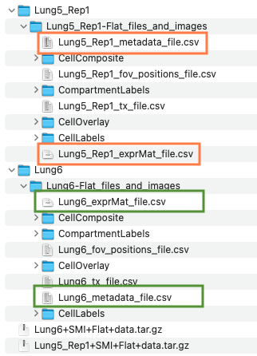
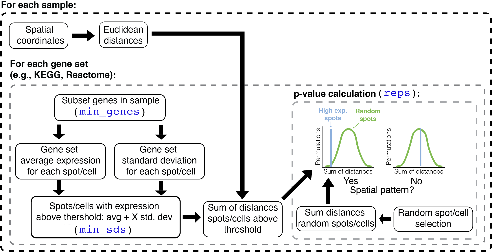

```{r vig_settings, include=F}
knitr::opts_chunk$set(
  collapse=TRUE,
  comment="#>",
  fig.width=8, fig.height=5
)
```

The package ***`spatialGE`*** can be used to detect spatial patterns in gene expression at the gene and gene set level. Data from multiple spatial transcriptomics platforms can be analyzed, as long as gene expression counts per spot or cell are associated with spatial coordinates of those spots/cells. The ***`spatialGE`*** package is compatible with outputs from the Visium workflow or the CosMx-SMI spatial single-cell platform.

In this tutorial, the functions `STenrich` and `STgradient` will be used to test for spatial gene set enrichment and genes with gradients expression on a [CosMx-SMI data set](https://nanostring.com/products/cosmx-spatial-molecular-imager/nsclc-ffpe-dataset/) from Non-Small Cell Lung Cancer (NSCLC).


<details>

<summary>**How is `spatialGE` installed? **</summary>

The `spatialGE` repository is available at GitHub and can be installed via `devtools`. To install `devtools` (in case it is not already installed in your R), please run the following code:

```{r install_devtools}
if("devtools" %in% rownames(installed.packages()) == FALSE){
  install.packages("devtools")
}
```

After making sure `devtools` is installed, proceed to install `spatialGE`:

```{r install_spatialGE, eval=T}
# devtools::install_github("fridleylab/spatialGE")
```

</details>


## Spatial gene set enrichment and expression gradients in non-small cell lung cancer (NSCLC)

The CosMx-SMI platform generates single-cell level gene expression with associated x and y locations of the cells where measurements were taken. In specific for this data set, counts were generated for 960 genes for about 800K cells. The data was generated from eight tissue slices, however, in this tutorial only two slides will be analyzed.

To start, data can be downloaded by accessing the links below. Please, note that each sample is about 1.5G. It is also likely that registration in the website is necessary in order to download the data set.

-   [Lung 5-1](https://nanostring.com/resources/smi-ffpe-dataset-lung5-rep1-data/)
-   [Lung 6](https://nanostring.com/resources/smi-ffpe-dataset-lung6-data/)

Create a folder in your computer's Desktop and name it "lung_cancer_smi". Place the downloaded files within the folder created in the Desktop. The downloaded files are compressed. Please decompress the files by double clicking on each file. The decompression might take a few seconds, and then, two directories should be generated. The structure of the files is shown below:


<p align="center">

</p>


The key files are shown enclosed in orange (Lung 5-1) and green (Lung 6) boxes. The "_exprMat_file.csv" file of each sample contains the gene counts. The "_metadata_file.csv" contains the cell x, y coordinates for each sample. 

Now, that the data is ready, load the `spatialGE` package:

```{r load_spatialGE, message=F}
library('spatialGE')
```

## Creating an STList (Spatial Transcriptomics List)

The starting point of a `spatialGE` analysis is the creation of an ***STlist***  (S4 class object), which stores raw and processed data. The STlist is created with the function `STlist`, which can take data in multiple formats (see [here](https://fridleylab.github.io/spatialGE/reference/STlist.html) for more info or type `?STlist` in the R console). In this tutorial we will provide the paths to the `exprMat` and `metadata` files for each of the two slides.

To load the files into an STlist, please use these commands:

```{r create_stlist, warning=F}
exprmats <- c('~/Desktop/lung_cancer_smi/Lung5_Rep1/Lung5_Rep1-Flat_files_and_images/Lung5_Rep1_exprMat_file.csv',
             '~/Desktop/lung_cancer_smi/Lung6/Lung6-Flat_files_and_images/Lung6_exprMat_file.csv')
metas <- c('~/Desktop/lung_cancer_smi/Lung5_Rep1/Lung5_Rep1-Flat_files_and_images/Lung5_Rep1_metadata_file.csv',
             '~/Desktop/lung_cancer_smi/Lung6/Lung6-Flat_files_and_images/Lung6_metadata_file.csv')

lung <- STlist(rnacounts=exprmats, spotcoords=metas, samples=c('Lung5_Rep1', 'Lung6'))
```
To obtain count statistics, the `summarize_STlist` function can be used:

```{r count_stats}
summarize_STlist(lung)
```

Some cells have zero counts. We can look at the distribution of counts per cell for the first five and last five FOVs using the `distribution_plots` function:

```{r count_dstr}
cp <- distribution_plots(lung, plot_type='violin', plot_meta='total_counts', samples=c(1:5, 56:60))
cp[['total_counts']]
```

Cells with zero counts, can be removed using the `filter_data` function. The function can also be used to remove all counts from specific genes. This option is useful in this case, as CosMx-SMI panels include negative probe genes. While the negative probes can be used in normalization of counts, in this tutorial those genes will be removed. Negative probes in CosMx-SMI begin with the token "NegPrb":

```{r filter_chunk}
lung <- filter_data(lung, spot_minreads=20, rm_genes_expr='^NegPrb')
```

## Transformation of spatially-resolved transcriptomics data

The function `transform_data` allows data transformation using one of two possible options. The first options applies log-transformation to the counts, after library size normalization performed on each sample separately. The second option applies variance-stabilizing transformation (SCT; @hafemeister_2019), which is a method increasingly used in single-cell and spatial transcriptomics studies. To apply SCT transformation, use the following command:

```{r norm_chunk, message=F}
lung <- transform_data(lung, method='sct')
```

## Detecting gene sets with spatial aggregation patterns

An important part of gene expression analysis is the use of gene sets to make inferences about the functional significance of changes in expression. Normally, this is achieved by conducting a Gene Set Enrichment Analysis (GSEA). While GSEA can be completed in a similar fashion to scRNA-seq, it is possible with the `STenrich` function to test for gene sets that show spatial non-uniform enrichment. In other words, `STenrich` tests whether expression of a gene set is concentrated in one or few areas of the tissue.

The algorithm in `STenrich` is depicted in the following diagram:


<p align="center">

</p>


The `STenrich` function is a modification of the method proposed by @hunter2021spatially. The steps in this modified version are as follows: First, Euclidean distances are calculated among all spots/cells. Then, the gene expression of the sample is subset to the genes within the gene set being tested. If too few genes are left after subset (`min_genes`), then the gene set is omitted for that sample. The average expression and standard deviation of those genes is calculated for each spot/cell. Next, spots/cells with gene set expression above the average gene set expression across all spots/cells are identified. The threshold to define these high gene set expression spots is defined by the average gene set expression plus a number `min_sds` of standard deviations. The sum of the Euclidean distances between the high expression spots/cells is calculated.

The next step involves a permutation process, in which a null distribution is generated in order to test if the (sum of) distances among high expression spots are smaller than expected. To that end, a random sample of spots/cells (regardless of expression) is selected. The random sample has the same size as the number of high expression spots/cells. Then, the sum of distances among the randomly sampled spots/cells is calculated. The random selection is repeated as many times as requested (`reps``). Finally, a p-value is calculated by noting how many times the sum of random distances was higher than the sum of distances among high expression spots/cells. If the sum of random distances was most of the times higher than the sum of distances among high expression spots/cells, then the null hypothesis of no spatial aggregation is rejected (i.e., spots/cells with high gene set expression are more aggregated than expected by chance).

A few important notes about the algorithm to consider:

- Notice that the metric of enrichment is currently the average expression of the genes in a set within each ROI/spot/cell. Better metrics of gene set enrichment are available and will be soon available to use instead of average.
- Special attention should be paid to the reference genome used to annotate gene counts. The annotation of transcripts precedes any analysis in spatialGE. Nevertheless, if transcripts are annotated with a mouse genome (or other species), the user should use the appropriate gene set database, as gene names will likely not match to a gene set database with human gene names. Furthermore, but not less important, there might be problems with gene homology.
- The more permutations are requested, the longer the execution, but p-value estimates are more accurate.
- By increasing the number of standard deviations, fewer spots/cells are selected as “high expression” (stringent analysis), however, it becomes more challenging to detect gene sets that show evidence of spatial aggregation. Values between 1 to 2 standard deviations are likely suitable for most studies.
- By adjusting the minimum number of spots (`min_spots`), the user has some rough control over the size of the structures to be studied. For example, small immune infiltrates could be detected with smaller number of minimum spots. Conversely, if tissue domain-level differences are sought, then a larger Minimum number of spots should be set.
- Take note of the random seed number used for the test (Seed number parameter), in case you need to generate the same results later. Nevertheless, running the analysis several times with different seed numbers is advisable to check for consistency.

The first step to run `STenrich` is to obtain a list of gene sets. Here, the `msigdbr` package will be used to obtain HALLMARK gene sets:

```{r genesets, message=F}
# Load msigdbr
library('msigdbr')

# Get HALLMARK gene sets
gene_sets <- msigdbr(species='Homo sapiens')
gene_sets <- gene_sets[gene_sets[['gs_cat']] == "H", ]

# Convert gene set dataframe to list
# The result is a named list. The names of the list are the names of each gene set
# The contents of each list element are the gene names within each gene set
gene_sets <- split(x=gene_sets[['gene_symbol']], f=gene_sets[['gs_name']])
```

Please keep in mind that it is assumed that HUGO gene names are used. For CosMx-SMI and Visium, normally *HUGO names* are provided. If spatial transcriptomics data from a non-human species is used, the appropriate database should be used. Otherwise, `spatialGE` will not be able to identify genes within the gene set.

The `STenrich` function can now be used. For this analysis, 1000 replicates (`reps=1000`) will be used to generate the null distribution. In addition, for a gene set to be considered as highly expressed in cell, it should be expressed at least over the average expression plus 1.5 standard deviations (`num_sds=1.5`). Gene sets with less than five genes in the sample (`min_genes=5`) and gene sets with less than 10 highly expressed cells (`min_units=10`) will not be tested. Notice a seed was set (`seed=12345`), which critical for replication of the results in the future. 

```{r stenrich}
stenrich_df <- STenrich(lung, gene_sets=gene_sets, 
                        reps=1000, 
                        num_sds=1.5, 
                        min_genes=5,
                        min_units=10, 
                        seed=12345) 
```

The result of the function is a list of data frames, with one data frame per samples (FOV in this case). For example, this is the data frame for the first FOV in the STlist:

```{r stenrich_df}
head(stenrich_df$Lung5_Rep1_fov_1)
```

Each row represents a test for the null hypothesis of no spatial aggregation in the expression of the set in the "gene_set" column. The column "size_test" is the number of genes of a gene set that were present in the FOV. The larger this number the better, as it indicates a better representation of the gene set in the sample. The "adj_p_value" is the multiple test adjusted p-value, which is the value used to decide if a gene set shows significant indications of a spatial pattern (adj_p_value < 0.05).

With a few lines of code, a visual summary can be generated that presents the gene sets with adj_p_value < 0.05 across FOVs for each tissue slide:

```{r message=F}
library('tidyverse')

res <- bind_rows(stenrich_df) %>%
  mutate(prop_gene_set=size_test/size_gene_set) %>%
  filter(prop_gene_set >= 0.3 & adj_p_value < 0.05) %>%
  mutate(slide=str_extract(sample_name, "Lung5_Rep1|Lung6")) %>%
  select(slide, gene_set) %>%
  mutate(gene_set=str_replace(gene_set, 'HALLMARK_', ''))

ggplot(res) + 
  geom_bar(aes(x=gene_set)) +
  xlab(NULL) +
  theme(axis.text.x=element_text(angle=70, vjust=1, hjust=1)) +
  facet_wrap(~slide)
```


## References

<div id="refs"></div>


<details>

<summary>**Session Info**</summary>

```{r}
sessionInfo()
```

</details>
