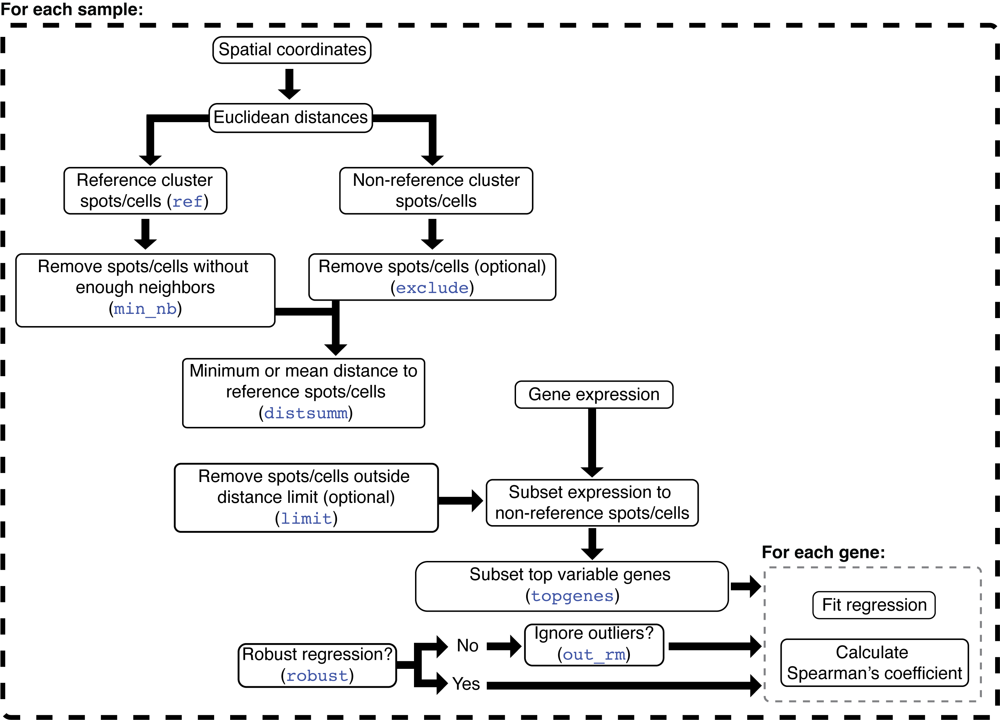

```{r vig_settings, include=F}
knitr::opts_chunk$set(
  collapse=TRUE,
  comment="#>",
  fig.width=8, fig.height=5
)
options(rmarkdown.html_vignette.check_title=F)
```

The package ***`spatialGE`*** can be used to detect spatial patterns in gene expression at the gene and gene set level. Data from multiple spatial transcriptomics platforms can be analyzed, as long as gene expression counts per spot or cell are associated with spatial coordinates of those spots/cells. The ***`spatialGE`*** package is also compatible with outputs from the Visium workflow (i.e., Space Ranger) or the CosMx-SMI spatial single-cell platform.

In this tutorial, the functions `STenrich`, `STclust`, and `STgradient` will be used to test for spatial gene set enrichment and genes showing expression gradients on a [CosMx-SMI data set](https://nanostring.com/products/cosmx-spatial-molecular-imager/nsclc-ffpe-dataset/) from Non-Small Cell Lung Cancer (NSCLC).


<details>

<summary>**How is `spatialGE` installed? **</summary>

The `spatialGE` repository is available at GitHub and can be installed via `devtools`. To install `devtools` (in case it is not already installed in your R), please run the following code:

```{r install_devtools}
if("devtools" %in% rownames(installed.packages()) == FALSE){
  install.packages("devtools")
}
```

After making sure `devtools` is installed, proceed to install `spatialGE`:

```{r install_spatialGE, eval=T}
# devtools::install_github("fridleylab/spatialGE")
```

</details>


## Spatial gene set enrichment and expression gradients in non-small cell lung cancer (NSCLC)

The CosMx-SMI platform generates single-cell level gene expression with associated x and y locations of the cells where measurements were taken. For the data set used in this tutorial, RNA counts were measured for 960 genes in about 800K cells. The data was generated from eight tissue slices, with counts obtained for a series of Fields of Vision (FOVs) within each slice. However, in this tutorial, the data set has been subset to 6 FOVs originating from two of the slices.

The complete data set can be downloaded from the links below. It is also likely that registration in the website is necessary in order to download the data set.

-   [Lung 5-1](https://nanostring.com/resources/smi-ffpe-dataset-lung5-rep1-data/)
-   [Lung 6](https://nanostring.com/resources/smi-ffpe-dataset-lung6-data/)

The data from the 6 FOVs used in this tutorial is available at the [spatialGE_Data GitHub repository](https://github.com/FridleyLab/spatialGE_Data). Data will be downloaded and deposited in a temporary directory. However, the download path can be changed within the following code block:

```{r data_download}
nsclc_tmp = tempdir()
unlink(nsclc_tmp, recursive=TRUE)
dir.create(nsclc_tmp)
download.file('https://github.com/FridleyLab/spatialGE_Data/raw/refs/heads/main/nanostring_nsclc.zip?download=', 
              destfile=paste0(nsclc_tmp, '/', 'nanostring_nsclc.zip'))
zip_tmp = list.files(nsclc_tmp, pattern='nanostring_nsclc.zip$', full.names=TRUE)
unzip(zipfile=zip_tmp, exdir=nsclc_tmp)
```

Data for each tissue slice is stored in separate folders. The structure of the files is shown below:


<p align="center">

</p>


The key files are shown enclosed in orange (Lung 5-1) and green (Lung 6) boxes. The "_exprMat_file.csv" file of each sample contains the gene counts. The "_metadata_file.csv" contains the cell x, y coordinates for each sample. Optionally, the "CellComposite" folder contains images that can be imported into the STlist (details later in this tutorial).

From the temporary directory, the file paths to be passed to the `STlist` function are:

```{r data_fpaths1}
# Find expression and coordinates files within the temporary folder
exprmats <- c(
  paste0(nsclc_tmp, '/nanostring_nsclc/Lung5_Rep1-Flat_files_and_images/Lung5_Rep1_exprMat_file_SUBSET.csv'),
  paste0(nsclc_tmp, '/nanostring_nsclc/Lung6-Flat_files_and_images/Lung6_exprMat_file_SUBSET.csv')
)
metas <- c(
  paste0(nsclc_tmp, '/nanostring_nsclc/Lung5_Rep1-Flat_files_and_images/Lung5_Rep1_metadata_file_SUBSET.csv'),
  paste0(nsclc_tmp, '/nanostring_nsclc/Lung6-Flat_files_and_images/Lung6_metadata_file_SUBSET.csv')
)
```

Now, that the data is ready, load the `spatialGE` package:

```{r load_spatialGE, message=F}
library('spatialGE')
```

## Creating an STList (Spatial Transcriptomics List)

The starting point of a `spatialGE` analysis is the creation of an ***STlist***  (S4 class object), which stores raw and processed data. The STlist is created with the function `STlist`, which can take data in multiple formats (see [here](https://fridleylab.github.io/spatialGE/reference/STlist.html) for more info or type `?STlist` in the R console).

To load the files into an STlist, please use these commands:

```{r create_stlist, warning=F}
lung <- STlist(rnacounts=exprmats, 
               spotcoords=metas, 
               samples=c('Lung5_Rep1', 'Lung6'), cores=2)
```

To obtain count statistics, the `summarize_STlist` function can be used:

```{r count_stats}
summ_df = summarize_STlist(lung)
summ_df
```

Some cells have zero counts. We can look at the distribution of counts per cell for the first five and last five FOVs using the `distribution_plots` function:

```{r count_dstr}
cp <- distribution_plots(lung, plot_type='violin', plot_meta='total_counts', samples=c(1:5, 56:60))
cp[['total_counts']]
```

Cells with zero counts, can be removed using the `filter_data` function. The function can also be used to remove all counts from specific genes. This option is useful in this case, as CosMx-SMI panels include negative probe genes. While the negative probes can be used in normalization of counts, in this tutorial those genes will be removed. Negative probes in CosMx-SMI begin with the token "NegPrb":

```{r filter_chunk}
lung <- filter_data(lung, spot_minreads=20, rm_genes_expr='^NegPrb')
```

## Transformation of spatially-resolved transcriptomics data

The function `transform_data` allows data transformation using one of two possible options. The first options applies log-transformation to the counts, after library size normalization performed on each sample separately. The second option applies variance-stabilizing transformation (SCT; @hafemeister_2019), which is a method increasingly used in single-cell and spatial transcriptomics studies. To apply SCT transformation, use the following command:

```{r norm_chunk, message=F}
lung <- transform_data(lung, method='sct', cores=2)
```

## Detecting gene sets with spatial aggregation patterns

An important part of gene expression analysis is the use of gene sets to make inferences about the functional significance of changes in expression. Normally, this is achieved by conducting a Gene Set Enrichment Analysis (GSEA). While GSEA can be completed in a similar fashion to scRNA-seq, it is possible with the `STenrich` function to test for gene sets that show spatial non-uniform enrichment. In other words, `STenrich` tests whether expression of a gene set is concentrated in one or few areas of the tissue.

The algorithm in `STenrich` is depicted in the following diagram:


<p align="center">

</p>


The `STenrich` function is a modification of the method proposed by @hunter2021spatially. The steps in this modified version are as follows: First, Euclidean distances are calculated among all spots/cells. Then, the gene expression of the sample is subset to the genes within the gene set being tested. If too few genes are left after subset (`min_genes`), then the gene set is omitted for that sample. The average expression and standard deviation of those genes is calculated for each spot/cell. Next, spots/cells with gene set expression above the average gene set expression across all spots/cells are identified. The threshold to define these high gene set expression spots is defined by the average gene set expression plus a number `min_sds` of standard deviations. The sum of the Euclidean distances between the high expression spots/cells is calculated.

The next step involves a permutation process, in which a null distribution is generated in order to test if the (sum of) distances among high expression spots are smaller than expected. To that end, a random sample of spots/cells (regardless of expression) is selected. The random sample has the same size as the number of high expression spots/cells. Then, the sum of distances among the randomly sampled spots/cells is calculated. The random selection is repeated as many times as requested (`reps``). Finally, a p-value is calculated by noting how many times the sum of random distances was higher than the sum of distances among high expression spots/cells. If the sum of random distances was most of the times higher than the sum of distances among high expression spots/cells, then the null hypothesis of no spatial aggregation is rejected (i.e., spots/cells with high gene set expression are more aggregated than expected by chance).

A few important notes about the algorithm to consider:

- Notice that the metric of enrichment is currently the average expression of the genes in a set within each ROI/spot/cell. Better metrics of gene set enrichment are available and will be soon available to use instead of average.
- Special attention should be paid to the reference genome used to annotate gene counts. The annotation of transcripts precedes any analysis in spatialGE. Nevertheless, if transcripts are annotated with a mouse genome (or other species), the user should use the appropriate gene set database, as gene names will likely not match to a gene set database with human gene names. Furthermore, but not less important, there might be problems with gene homology.
- The more permutations are requested, the longer the execution, but p-value estimates are more accurate.
- By increasing the number of standard deviations, fewer spots/cells are selected as “high expression” (stringent analysis), however, it becomes more challenging to detect gene sets that show evidence of spatial aggregation. Values between 1 to 2 standard deviations are likely suitable for most studies.
- By adjusting the minimum number of spots (`min_spots`), the user has some rough control over the size of the structures to be studied. For example, small immune infiltrates could be detected with smaller number of minimum spots. Conversely, if tissue domain-level differences are sought, then a larger Minimum number of spots should be set.
- Take note of the random seed number used for the test (Seed number parameter), in case you need to generate the same results later. Nevertheless, running the analysis several times with different seed numbers is advisable to check for consistency.

The first step to run `STenrich` is to obtain a list of gene sets. Here, the `msigdbr` package will be used to obtain HALLMARK gene sets:

```{r genesets, message=F}
# Load msigdbr
library('msigdbr')

# Get HALLMARK gene sets
gene_sets <- msigdbr(species='Homo sapiens')
gene_sets <- gene_sets[gene_sets[['gs_cat']] == "H", ]

# Convert gene set dataframe to list
# The result is a named list. The names of the list are the names of each gene set
# The contents of each list element are the gene names within each gene set
gene_sets <- split(x=gene_sets[['gene_symbol']], f=gene_sets[['gs_name']])
```

For the purpose of this example, we will only test "signaling" pathways:
```{r genesets_sub, message=F}
gene_sets = gene_sets[grep('SIGNALING', names(gene_sets))]
```

Please keep in mind that it is assumed that HUGO gene names are used. For CosMx-SMI and Visium, normally *HUGO names* are provided. If spatial transcriptomics data from a non-human species is used, the appropriate database should be used. Otherwise, `spatialGE` will not be able to identify genes within the gene set.

The `STenrich` function can now be used. For this analysis, 1000 replicates (`reps=1000`) will be used to generate the null distribution. In addition, for a gene set to be considered as highly expressed in cell, it should be expressed at least over the average expression plus 1.5 standard deviations (`num_sds=1.5`). Gene sets with less than five genes in the sample (`min_genes=5`) and gene sets with less than 10 highly expressed cells (`min_units=10`) will not be tested. Notice a seed was set (`seed=12345`), which critical for replication of the results in the future. 

```{r stenrich}
stenrich_df <- STenrich(lung, gene_sets=gene_sets, 
                        reps=1000, 
                        num_sds=1.5, 
                        min_genes=5,
                        min_units=10, 
                        seed=12345, cores=2) 
```

The result of the function is a list of data frames, with one data frame per samples (FOV in this case). For example, this is the data frame for the first FOV in the STlist:

```{r stenrich_df}
head(stenrich_df$Lung5_Rep1_fov_1)
```

Each row represents a test for the null hypothesis of no spatial aggregation in the expression of the set in the "gene_set" column. The column "size_test" is the number of genes of a gene set that were present in the FOV. The larger this number the better, as it indicates a better representation of the gene set in the sample. The "adj_p_value" is the multiple test adjusted p-value, which is the value used to decide if a gene set shows significant indications of a spatial pattern (adj_p_value < 0.05).

With a few lines of code, a visual summary can be generated that presents the gene sets with adj_p_value < 0.05 across FOVs for each tissue slide:

```{r message=F}
# Load tidyverse for data frame manipulation
library('tidyverse')

# Combine all samples in a single data frame
# Subset to gene sets showing significant evidence of spatial pattern (adj_p_value < 0.05) and
# proportion higher or equal than 0.3 of genes from a gene set present in sample 
res <- bind_rows(stenrich_df) %>%
  mutate(prop_gene_set=size_test/size_gene_set) %>%
  filter(prop_gene_set >= 0.3 & adj_p_value < 0.05) %>%
  mutate(slide=str_extract(sample_name, "Lung5_Rep1|Lung6")) %>%
  select(slide, gene_set) %>%
  mutate(gene_set=str_replace(gene_set, 'HALLMARK_', ''))

# Generate barplot showing the number of FOVs with siginificant evidence of spatial
# patterns for each tissue slide
ggplot(res) + 
  geom_bar(aes(x=gene_set)) +
  xlab(NULL) +
  theme(axis.text.x=element_text(angle=70, vjust=1, hjust=1)) +
  facet_wrap(~slide)
```

The "NOTCH signaling" pathway showed spatial patterns less frequently in the slide "Lung5_Rep1" compared to "Lung6". With the function `STplot`, the average gene set expression for this pathway can be plotted. First, FOVs with and without NOTCH signaling spatial patterns will be identified from "Lung5_Rep1" and "Lung6" respectively.

```{r notch_sig1}
bind_rows(stenrich_df) %>%
  mutate(prop_gene_set=size_test/size_gene_set) %>%
  filter(prop_gene_set >= 0.3 & adj_p_value >= 0.05) %>%
  arrange(desc(prop_gene_set), desc(adj_p_value)) %>%
  filter(gene_set == 'HALLMARK_NOTCH_SIGNALING') %>%
  filter(str_detect(sample_name, "Lung5_Rep1")) %>%
  slice_head(n=3)
```

```{r notch_sig2}
bind_rows(stenrich_df) %>%
  mutate(prop_gene_set=size_test/size_gene_set) %>%
  filter(prop_gene_set >= 0.3 & adj_p_value < 0.05) %>%
  arrange(desc(prop_gene_set), adj_p_value) %>%
  filter(gene_set == 'HALLMARK_NOTCH_SIGNALING') %>%
  filter(str_detect(sample_name, "Lung6")) %>%
  slice_head(n=3)
```

Plots can be generated like so:

```{r notch_plots, fig.width=10}
qp <- STplot(lung, genes=gene_sets[names(gene_sets) == 'HALLMARK_NOTCH_SIGNALING'], 
             samples=c('Lung5_Rep1_fov_2', 'Lung5_Rep1_fov_6', 'Lung5_Rep1_fov_11',
                       'Lung6_fov_4', 'Lung6_fov_6', 'Lung6_fov_7'),
             color_pal='YlOrBr')

ggpubr::ggarrange(plotlist=qp, ncol=3, nrow=2, common.legend=TRUE)
```


Although expression of the NOTCH signaling pathway is higher overall in "Lung6", the expression is not uniform, but rather is arranged in patterns within each FOV. Conversely, cells in FOVs of "Lung5_Rep1" that show high expression of the NOTCH signaling pathway are scattered across the tissue.

Since this expression of this pathway has been identified as spatially aggregated, it might be of interest to know if there is correspondence of NOTCH signaling with tissue domains. With the `STclust` function, tissue domains can be identified. 

```{r stclust_smi}
lung <- STclust(lung, ws=0.02, ks='dtc', cores=2)
```

Optinally, if tissue images are available for some or all the FOVs, users can upload those to the STlist for display next to the other plot types available in `spatialGE`. Users can upload an entire folder of images to the STlist, as long as image files have the same names as the FOVs within the STlist (e.g., "Lung5_Rep1_fov_2", "Lung6_fov_4", etc). Keep in mind, however, this will increase the size of the STlist significantly, especially in CosMx experiments that usually contain many FOVs. 

The multiplexed immunofluorescence images have been previously downloaded from the [spatialGE_Data GitHub repository](https://github.com/FridleyLab/spatialGE_Data). The temporary folder created at the beggining of this tutorial will be used to generate the file paths to the folder containng the images. Importantly, the images need to be renamed according to the FOV name in the STlist. This renaming was already performed for the files in the spatialGE_Data GitHub repository. Here is an example of how the files were renamed from the original data set:

- For tissue slice "Lung5_Rep1", images were renamed from "CellComposite_F002.jpg", "CellComposite_F006.jpg", and "CellComposite_F011.jpg" to "Lung5_Rep1_fov_2.jpg", "Lung5_Rep1_fov_6.jpg", and "Lung5_Rep1_fov_11.jpg" respectively.
- For tissue slice "Lung6", images were renamed from "CellComposite_F004.jpg", "CellComposite_F006.jpg", and "CellComposite_F007.jpg" to "Lung6_fov_4.jpg", "Lung6_fov_6.jpg", and "Lung6_fov_7.jpg" respectively.

Now, upload the images to the STlist with the `load_images` function:

```{r loadimages1}
img_fp = paste0(nsclc_tmp, '/nanostring_nsclc/Lung5_Rep1-Flat_files_and_images/CellComposite')
lung <- load_images(lung, images=img_fp)
```

The images for slide "Lung6" were not found, which are in the corresponsing folder. The `load_images` function is ran again to add images from "Lung6":

```{r loadimages2}
img_fp = paste0(nsclc_tmp, '/nanostring_nsclc/Lung6-Flat_files_and_images/CellComposite')
lung <- load_images(lung, images=img_fp)
```

The function `plot_image` is used to generate the ggplot objects containing the images:

```{r plotimages}
ti <- plot_image(lung)
```

The domains can be plotted with the `STplot` function too.

```{r plot_domains, fig.width=12}
dom_p <- STplot(lung, ks='dtc', ws=0.02, deepSplit=FALSE,
                color_pal='discreterainbow')

ggpubr::ggarrange(dom_p$Lung5_Rep1_fov_2_stclust_spw0.02_dsplFalse,
                  ti$image_Lung5_Rep1_fov_2,
                  dom_p$Lung5_Rep1_fov_6_stclust_spw0.02_dsplFalse,
                  ti$image_Lung5_Rep1_fov_6,
                  dom_p$Lung5_Rep1_fov_11_stclust_spw0.02_dsplFalse,
                  ti$image_Lung5_Rep1_fov_11,
                  dom_p$Lung6_fov_4_stclust_spw0.02_dsplFalse,
                  ti$image_Lung6_fov_4,
                  dom_p$Lung6_fov_6_stclust_spw0.02_dsplFalse,
                  ti$image_Lung6_fov_6,
                  dom_p$Lung6_fov_7_stclust_spw0.02_dsplFalse,
                  ti$image_Lung6_fov_7,
                  ncol=4, nrow=3)

# If no tissue images are available:
# ggpubr::ggarrange(plotlist=dom_p, ncol=3, nrow=2)
```

Now, to identify the domains, differential gene expression can be performed:

```{r domain_de}
deg <- STdiff(lung, w=0.02, k='dtc', deepSplit=FALSE, test_type='wilcoxon', cores=2)
```

Then, the top 3 DE genes per cluster in the samples showing NOTCH signaling spatial patterns are identified:

```{r top_de}
bind_rows(deg) %>%
  filter(adj_p_val < 0.05 & abs(avg_log2fc > 0.05)) %>%
  filter(sample %in% c('Lung6_fov_4', 'Lung6_fov_6', 'Lung6_fov_7')) %>%
  group_by(sample, cluster_1) %>%
  slice_head(n=3)
```

Expression of KRT genes in domains 1 and 2 of FOVs "Lung6_fov_4" and "Lung6_fov_7", and domains 2 and 4 of "Lung6_fov_6" are indicative of tumor cells. In those domains (with the exception of 4 in "Lung6_fov_6"), there seems to be an overlap with the areas of of NOTCH signaling, which indicates that in slide "Lung6", the tumor compartment is spatially enriched for NOTCH signaling.

## Identifcation of genes presenting expression spatial gradients 

Since the tumor areas have been visually identified, it is possible now to ascertain which genes show expression that varies with distance within the tumor compartment. In the FOVs "Lung6_fov_4", "Lung6_fov_7", and "Lung6_fov_6", the domain 3 seems to be surrounding the tumor compartment. Hence, domain 3 will be used as reference domain to test for genes for which expression increases or decreases with distance from domain 3. This test is performed by the `STgradient` function. The following diagram depicts the `STgradient` algorithm:


<p align="center">

</p>


In `STgradient`, the spatial coordinates are used to calculate Euclidean distances of each cell to each of the other cells. The reference domain is the domain from which the distances will be calculated (domain 3 in this case). The non-reference domain(s) are the domain(s) on which the user wants to study gradients. Next, removes isolated spots/cells in the reference domain (i.e., have a number of immediate neighbors smaller than parameter `min_nb`). The `min_nb` parameter intends to reduce the effects of small “pockets” of the reference domain on the correlation coefficient. At this point, either the minimum or average distance of each non-reference cell to each reference cell is calculated (`distsumm`). The minimum distance is easier to interpret, however, it is more sensitive to highly fragmented reference domains. On the other hand, the interpretability of the average distance is not as easy as the minimum distance, but it might detect in a better way the gradients when the reference domain is distributed across the sample. Next, the gene expression data is subset to the non-reference spots/cells, and the top variable genes (`topgenes`) are selected. Results will be produced only for those genes. Depending on the user’s selection, the ordinary least squares (OLS) or robust regression is used to calculate the slope of the regression line between the minimum/average distance and the expression of a gene. If OLS was selected, users might opt to remove outliers via the interquartile method. Finally, the Spearman’s coefficient is calculated in addition to the regression line coefficient. The slope indicates the direction of the correlation. If positive, the gene expression tends to be higher when farther from the reference domain. If negative, gene expression is higher when closer to the reference domain. The interpretation of the sign for the Spearman’s coefficient is similar, however its magnitude indicates how strong the correlation is between gene expression and distance to the reference domain.

The `STgradient` function can be executed with these commands, in order to test for gradients within the tumor compartment. First, it is necessary to find the name of the column in `lung_subset@spatial_meta` containing the domain assigments:

```{r columnnames}
colnames(lung@spatial_meta$Lung5_Rep1_fov_2)
```

The name of the column is `stclust_spw0.02_dsplFalse` (STclust results using spatial weight of 0.02 and DynamicTreeCuts with no deepSplit). This name is used in the `annot` argument of `STgradient`:

```{r stgradient_run}
stg <- STgradient(lung, 
                  topgenes=1000, 
                  annot='stclust_spw0.02_dsplFalse',
                  ref=3,
                  samples=c('Lung6_fov_4', 'Lung6_fov_6', 'Lung6_fov_7'), 
                  distsumm='min', 
                  robust=TRUE, cores=2)
```

Here are the first few rows of the `STgradient` result for sample "Lung6_fov_4":

```{r stg_res}
head(stg$Lung6_fov_4)
```

The key columns to look ar are `min_spearman_r` and `min_spearman_r_pval_adj`. Now, to find genes with significant spatial gradients across the three samples,
these commands can be used:

```{r topstg}
bind_rows(stg) %>%
  arrange(desc(abs(min_spearman_r))) %>%
  group_by(sample_name) %>%
  slice_head(n=5) %>%
  ungroup() %>%
  arrange(gene)
```

It can be seen from these results that multiple keratin genes show spatial gradients, all of them with negative Spearman's coefficients (cells close to domain 3 tend to have higher keratin expression). Other such __HLA-B__ and __NDRG1__ have higher expression in cells far from domain 3: 

```{r stg_plots}
qp2 <- STplot(lung, genes=c('KRT6A', 'HLA-B'), samples='Lung6_fov_4', color_pal='YlOrBr')
ggpubr::ggarrange(plotlist=qp2, common.legend=TRUE)
```

Here are the results for genes within the NOTCH signaling pathway:

```{r stg_notch}
bind_rows(stg) %>%
  arrange(desc(abs(min_spearman_r))) %>%
  filter(gene %in% gene_sets[['HALLMARK_NOTCH_SIGNALING']]) %>%
  filter(min_spearman_r_pval_adj < 0.05)
```

Although the correlations in genes from this pathway are not as large as and those for __KRT6A__ and __HLA-B__ (i.e., lower absolute Spearman's coefficient), it can be seen that the genes __NOTCH1__ and __NOTCH3__ show evidence of expression gradients in FOVs 'Lung6_fov_4' and 'Lung6_fov_6'.

## References

<div id="refs"></div>


<details>

<summary>**Session Info**</summary>

```{r}
sessionInfo()
```

</details>
